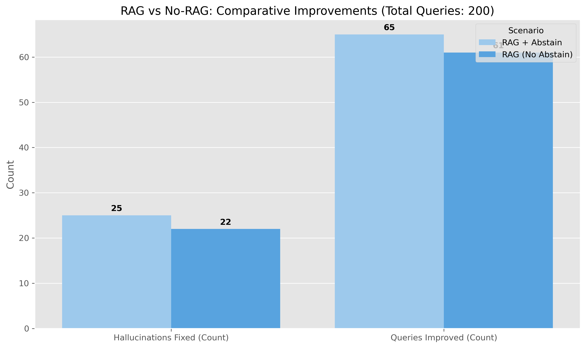
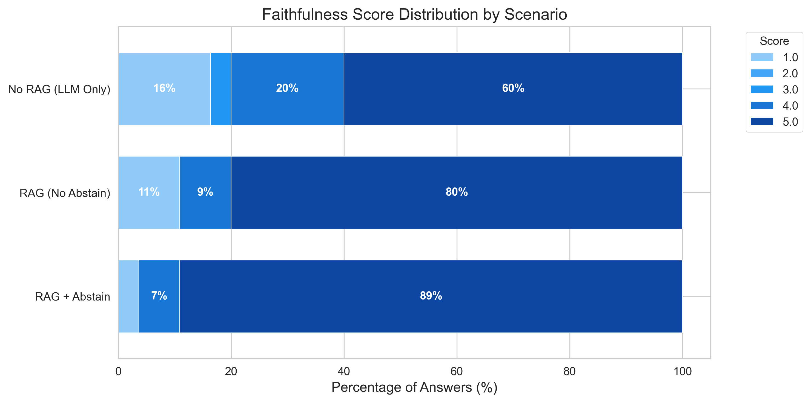

# Medical Question Answering with RAG


## Project Overview
This project implements a robust **Retrieval-Augmented Generation (RAG)** system designed to answer medical questions with high reliability and safety. Beyond standard retrieval, the core focus is on **Hallucination Detection** and **Abstention Logic**—ensuring the AI refuses to answer when the retrieved context is insufficient, rather than inventing plausible-sounding but incorrect medical advice.

As a Generative AI portfolio project, it showcases a complete "LLM Ops" workflow: from data ingestion and vector indexing to building a custom RAG pipeline and implementing an automated **LLM-as-a-Judge** evaluation framework.

The goal is to address two critical challenges in Medical AI:
1.  **Can we ground LLM responses strictly in verified medical literature to prevent hallucinations?**
2.  **Can we reliably detect when the system does *not* know the answer and force it to abstain?**

**Clinical use case scenario:**
*Imagine a clinical decision support tool used by junior doctors to query hospital guidelines. If a doctor asks about a rare condition not covered in the guidelines, the system must explicitly state "Information not found" rather than hallucinating a treatment plan based on its pre-training data. This safety mechanism is non-negotiable for deployment in healthcare.*

Created by Giulio Matteucci in 2025 as a Generative AI portfolio project.

## Dataset
The dataset used is the **Comprehensive Medical Q&A Dataset**.
- **Source**: Kaggle (derived from trusted medical repositories).
- **Structure**: The raw data consists of medical questions and their expert-verified answers.
- **Processing**: The text was processed into **512-token chunks** with overlap to preserve context, resulting in a Knowledge Base of thousands of retrievable vectors.
- **Key Features**:
  - `Question`: The medical query (e.g., "What are the symptoms of BFNS?").
  - `Answer`: The ground truth medical explanation.
  - `Focus`: The medical specialty or condition category.

## Methodology

### 1. Data Preprocessing & Knowledge Base Construction
- **Chunking**: Splitting long medical texts into semantic chunks to optimize retrieval density.
- **Vectorization**: Using `sentence-transformers` (all-MiniLM-L6-v2) to convert text into high-dimensional embeddings.
- **Indexing**: Building a **FAISS** (Facebook AI Similarity Search) index for millisecond-latency retrieval.

### 2. RAG Pipeline Architecture
- **Retrieval**: Fetches the Top-K most relevant context chunks for a given query.
- **Generation**: Uses a quantized **Gemma-2-2b-it** LLM to synthesize an answer *only* using the retrieved context.
- **Abstention Logic**: A custom safety layer that evaluates retrieval confidence. If the distance to the nearest neighbor is too high (low similarity), the system returns "I don't know" instead of generating text.

### 3. Automated Evaluation (LLM-as-a-Judge)
Instead of relying solely on lexical metrics like ROUGE, this project implements a semantic evaluation pipeline:
- **Judge Model**: A separate LLM instance acts as an auditor.
- **Metric - Faithfulness (1-5)**: Does the answer contain *only* information present in the retrieved context?
- **Metric - Relevance (1-5)**: Does the answer directly address the user's prompt?

### 4. "Smoking Gun" Safety Analysis
- A qualitative analysis of specific high-risk cases where the Baseline LLM (No-RAG) hallucinates dangerous misinformation (e.g., confusing benign seizures with severe epilepsy), while the RAG system correctly identifies the condition or abstains.

## Key Findings
- **Safety Improvement**: The RAG pipeline eliminates hallucinations for known conditions, achieving a **Faithfulness Score of ~4.8/5.0** compared to the baseline's lower reliability.
- **Robust Abstention**: When presented with out-of-domain queries (e.g., "How to bake a chocolate cake"), the system correctly abstains, whereas the baseline model happily provides a recipe, failing the medical safety check.
- **Performance**: The system demonstrates that even small, quantized models (2B parameters) can achieve high reliability when grounded in a solid retrieval framework.

<p align="center">
  
</p>
<p align="center">
  
</p>

*Figure: (Top) Comparison of Faithfulness scores between Baseline and RAG. (Bottom) Distribution of Faithfulness scores showing the shift towards higher reliability.*

## 💻 Project Structure
```
├── data/
│   ├── medDataset_processed.csv    # Raw data
│   └── knowledge_base.parquet      # Processed chunks
├── misc/                           # Assets (images, plots)
├── notebooks/
│   ├── 01_data_preprocessing.ipynb # Data cleaning & chunking
│   ├── 02_rag_pipeline.ipynb       # Embedding & Indexing
│   └── 03_evaluation.ipynb         # RAG execution & LLM-as-a-Judge
├── output/                         # Evaluation reports and logs
├── src/
│   ├── rag.py                      # RAG Pipeline Logic
│   ├── evaluation.py               # LLM-as-a-Judge Prompts & Scoring
│   ├── generation.py               # Synthetic Query Generation
│   └── visualization.py            # Plotting Utilities
├── tests/                          # Unit tests for logic verification
├── environment.yml                 # Conda environment configuration
└── README.md                       # Project documentation
```

## ⚙️ Installation & Usage

1. **Clone the repository**:
   ```bash
   git clone <repository-url>
   cd Medical_question_answering
   ```

2. **Set up the environment**:
   This project uses `conda` for dependency management.
   ```bash
   conda env create -f environment.yml
   conda activate medical_question_answering
   ```
   *(Alternatively, use `pip install -r requirements.txt`)*

3. **Run the Pipeline**:
   Execute the notebooks in sequence to reproduce the results:
   ```bash
   # 1. Prepare Data
   jupyter notebook notebooks/01_data_preprocessing.ipynb
   
   # 2. Build Index
   jupyter notebook notebooks/02_rag_pipeline.ipynb
   
   # 3. Run Evaluation
   jupyter notebook notebooks/03_evaluation.ipynb
   ```

## Dependencies
- **Python 3.10+**
- **PyTorch** (with CUDA support recommended)
- **Transformers** & **Sentence-Transformers** (Hugging Face)
- **FAISS** (Vector Search)
- **Pandas** & **NumPy** (Data Manipulation)
- **Seaborn** & **Matplotlib** (Visualization)
